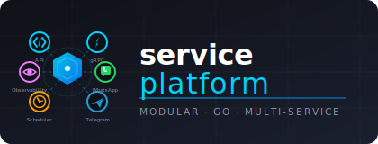

# service-platform

<p align="center">
  
</p>

> A modular Go platform delivering APIs, WhatsApp/Twilio messaging, schedulers, monitoring, and automation services in one repo.
> 
> 📸 **[Check out the Project Previews](./preview/README.MD)** for a visual guide to the CLI, API, Grafana, and MongoDB interfaces.


## ⚙️ Live at a glance

| Service | Entry point | Type | Status (docs) |
|---------|-------------|------|--------------|
| API + Admin | `cmd/api/main.go` | HTTP + GRPC | [REST API docs](docs/swagger.yaml)
| WhatsApp worker | `cmd/whatsapp/main.go` | Messaging | 💬 Handles WhatsApp chats (using Whatsmeow)
| Twilio WhatsApp | `cmd/twilio/whatsapp/main.go` | gRPC + Twilio SDK | ✅ Rich media + rate limits (see docs)
| Telegram | `cmd/telegram/main.go` | gRPC + Bot API | 📱 Telegram bot service
| Scheduler | `cmd/scheduler/main.go` | Cron jobs | ⏱️ Cron-based jobs from `internal/scheduler`
| Monitoring | `cmd/monitoring/main.go` | Prometheus/Grafana/Tempo | [monitoring guide](docs/MONITORING.md)
| n8n | `cmd/n8n/main.go` | Workflow automation | Integrations via [docs/N8N_TESTING_GUIDE.md](docs/N8N_TESTING_GUIDE.md)
| CLI (TUI) | `cmd/cli/main.go` | Bubbletea TUI | 🖥️ Interactive + non-interactive CLI

## 🧭 Getting started (5 mins)

1. Clone and install Go 1.26 + Podman/Docker.
2. Copy `internal/config/service-platform.dev.yaml` → `service-platform.<env>.yaml`, then fill secrets (DB, Twilio, monitoring ports, etc.).
3. **Quick start with Docker Compose** (recommended):
   ```bash
   make docker-up          # starts Postgres, Redis, MongoDB + all services
   make docker-ps          # check status
   make docker-logs        # tail all logs
   ```
   Or start infrastructure only, then run services natively:
   ```bash
   make docker-up-infra    # Postgres, Redis, MongoDB, Mongo Express
   make run-api            # run API locally against containerised DBs
   ```
4. Alternatively, bring up deps individually: `make mongo-up`, `make monitoring-start`.
5. Run `make build` or `go run` the service you need (`cmd/api`, `cmd/whatsapp`, etc.).
6. Run `make test` or targeted suites (`make test-twilio`, `make test-mongo`, k6 targets).
7. **Interactive CLI**: `make cli` launches the Bubbletea TUI for all commands.

## 💡 Highlighted features

### 📦 Modular binaries
- Each `cmd/<service>` builds its own binary so you can deploy just what you need.
- Shared logic in `internal/` (config loader, Twilio & WhatsApp clients, middleware, rate limiter).

### 🖥️ Interactive CLI (Bubbletea TUI)
- Launch with `make cli` or build with `make build-cli` then run `./bin/cli`.
- Categories: Run Services, Build, Database, Monitoring, Docker Compose, Testing, K6, N8N, and more.
- Features: keyboard navigation, `/` global search, multi-select batch builds, dangerous-action confirmation.
- Non-interactive mode for scripts/CI: `./bin/cli run-api`, `./bin/cli list docker`, `./bin/cli help`.

### 🐳 Docker Compose (full-stack local dev)
- Single `docker/docker-compose.yml` with profiles: **infra** (Postgres, Redis, MongoDB), **services** (all app services), **tools** (CLI).
- Dockerfiles for every service: API, gRPC, Scheduler, WhatsApp, Telegram, Twilio WhatsApp, CLI.
- 18 Makefile targets: `docker-up`, `docker-up-infra`, `docker-up-services`, `docker-down`, `docker-build`, `docker-ps`, `docker-logs`, `docker-logs-<service>`, `docker-restart`, `docker-pull`, etc.
- Auto-detects Podman Compose / Docker Compose (v2 plugin) / docker-compose (v1).

### 🧵 Twilio WhatsApp stack
- Config: `internal/config/service-platform.dev.yaml` (overridden by ENV + `config_mode`/`conf.yaml`).
- Client + gRPC: `internal/twilio/client.go` + `cmd/twilio/whatsapp/main.go`. See [docs/TWILIO_WHATSAPP_SETUP.md](docs/TWILIO_WHATSAPP_SETUP.md).
- Integration tests: `tests/twilio/client_test.go` uses real Twilio credentials, media payloads, rich text, and mentions.

### 🧠 Monitoring & observability
- Podman-first monitoring stack managed via `scripts/monitoring-quickstart.sh` (fallback to Docker Compose).
- Grafana dashboards auto-provisioned from `monitoring/grafana/`, Prometheus scrapes each service, Loki & Tempo ingest logs/traces.
- Reference: [docs/MONITORING.md](docs/MONITORING.md), [docs/LOKI_TEMPO_SETUP.md](docs/LOKI_TEMPO_SETUP.md), [docs/LOKI_QUICKSTART.md](docs/LOKI_QUICKSTART.md).

### 🧪 Testing & performance
- `make test` → all Go tests (`./tests/...`, migrations).
- Unit tests for middleware and `pkg/fun` utilities in `tests/unit/` (90+ tests covering security headers, XSS sanitization, password hashing, phone validation, rate limiting, etc.).
- Twilio focused: `make test-twilio`, Twilio sandbox helper `scripts/test-twilio-whatsapp.sh`.
- k6 scripts under `tests/k6/` with `make k6-*` helpers; metrics flow into Grafana via Prometheus (configuration described in [docs/K6_INTEGRATION.md](docs/K6_INTEGRATION.md)).

### ⚙️ Automation + migration
- Migrations: `cmd/migrate`, `make migrate-up/down/reset/status` with GORM.
- Seeders: `cmd/seed`, targeted helpers like `make seed-whatsapp`, `make seed-users`.

### 📘 Documentation hub
- Read the rest: `docs/TWILIO_WHATSAPP_SETUP.md`, `docs/TWILIO_WHATSAPP_GUIDE.md`, `docs/TWILIO_SANDBOX_TROUBLESHOOTING.md`, `docs/MONITORING_SETUP_COMPLETE.md`, `docs/N8N_TESTING_GUIDE.md`, `docs/K6_INTEGRATION.md`.
- Swagger specs live in `docs/swagger.yaml`/`.json`; run `make swagger` to regenerate.

## 🎛️ Config & secrets

- Default config mode set via `internal/config/conf.yaml` (dev/prod detection via `ENV`, `GO_ENV`).
- Always edit `internal/config/service-platform.<env>.yaml` and keep secrets out of Git.
- Example sections: Twilio credentials, metrics ports, rate limiting, observability endpoints, k6 thresholds. Search `service-platform.dev.yaml` for templates.

## 🚀 Deploy & CI

- Multi-stage Dockerfiles for all services (API, gRPC, Scheduler, WhatsApp, Telegram, Twilio WhatsApp, CLI) assemble statically linked binaries.
- Full-stack `docker/docker-compose.yml` for one-command local dev: `make docker-up`.
- CI frameworks in `.github/workflows/` run lint, test, build, security scans, and releases (see README under `.github/` for workflow details).
- Dependabot lives in `.github/dependabot.yml` for dependency hygiene.

## 🧩 Need help?

- `make help` lists all targets (build, run, monitoring, docker, tests, k6, etc.).
- `make cli` launches the interactive TUI for browsing and executing all targets.
- `scripts/` contains helper tooling (monitoring stack, monitoring-cleanup, k6 runner, Twilio sandbox tests).
- For Twilio messaging questions consult `docs/TWILIO_WHATSAPP_GUIDE.md` and `docs/TWILIO_SANDBOX_TROUBLESHOOTING.md`.

## � Special Thanks & Tech Stack

This project stands on the shoulders of many great open-source libraries and tools. Huge thanks to every maintainer and contributor behind these projects.

### 💬 Messaging
| Library | Description |
|---------|-------------|
|  [whatsmeow](https://github.com/tulir/whatsmeow) | Go library for the WhatsApp Web multi-device API |
|  [twilio-go](https://github.com/twilio/twilio-go) | Official Twilio Go helper library |
|  [telegram-bot-api](https://github.com/go-telegram-bot-api/telegram-bot-api) | Golang bindings for the Telegram Bot API |

### 🌐 Web & API
| Library | Description |
|---------|-------------|
|  [Gin](https://github.com/gin-gonic/gin) | High-performance HTTP web framework |
|  [gin-swagger](https://github.com/swaggo/gin-swagger) | Swagger UI middleware for Gin |
|  [swag](https://github.com/swaggo/swag) | Swagger docs generator from Go annotations |
|  [gorilla/websocket](https://github.com/gorilla/websocket) | WebSocket implementation for Go |
|  [gin-contrib/cors](https://github.com/gin-contrib/cors) | CORS middleware for Gin |
|  [api-analytics](https://github.com/tom-draper/api-analytics) | Lightweight API analytics middleware |

### 🖥️ TUI (Interactive CLI)
| Library | Description |
|---------|-------------|
|  [Bubbletea](https://github.com/charmbracelet/bubbletea) | The fun, functional, and stateful way to build terminal apps |
|  [Bubbles](https://github.com/charmbracelet/bubbles) | TUI components for Bubbletea |
|  [Lipgloss](https://github.com/charmbracelet/lipgloss) | Style definitions for terminal layouts |

### 🗄️ Database & Storage
| Library | Description |
|---------|-------------|
|  [GORM](https://github.com/go-gorm/gorm) | ORM library for Go (Postgres, MySQL, SQLite) |
|  [mongo-driver](https://github.com/mongodb/mongo-go-driver) | Official MongoDB Go driver |
|  [go-redis](https://github.com/redis/go-redis) | Redis client for Go |
|  [redis_rate](https://github.com/go-redis/redis_rate) | Redis-backed rate limiting |

### 📡 gRPC & Protobuf
| Library | Description |
|---------|-------------|
|  [grpc-go](https://github.com/grpc/grpc-go) | Go implementation of gRPC |
|  [protobuf](https://github.com/protocolbuffers/protobuf-go) | Go support for Google Protocol Buffers |

### 📊 Observability & Monitoring
| Library | Description |
|---------|-------------|
|  [OpenTelemetry Go](https://github.com/open-telemetry/opentelemetry-go) | Distributed tracing and metrics (OTLP/Tempo) |
|  [prometheus/client_golang](https://github.com/prometheus/client_golang) | Prometheus metrics instrumentation |
|  [Logrus](https://github.com/sirupsen/logrus) | Structured, leveled logging |
|  [lumberjack](https://github.com/natefinch/lumberjack) | Rolling log file writer |

### ⏱️ Scheduling
| Library | Description |
|---------|-------------|
|  [gocron](https://github.com/go-co-op/gocron) | Job scheduling framework for Go |
|  [robfig/cron](https://github.com/robfig/cron) | Cron expression parser (used by gocron) |

### 🔐 Auth & Security
| Library | Description |
|---------|-------------|
|  [golang-jwt](https://github.com/golang-jwt/jwt) | JWT implementation for Go |
|  [bluemonday](https://github.com/microcosm-cc/bluemonday) | HTML sanitizer for XSS protection |
|  [bcrypt / golang.org/x/crypto](https://github.com/golang/crypto) | Password hashing and cryptographic primitives |

### 🛠️ Utilities
| Library | Description |
|---------|-------------|
|  [godotenv](https://github.com/joho/godotenv) | `.env` file loader |
|  [go-playground/validator](https://github.com/go-playground/validator) | Struct and field validation |
|  [phonenumbers](https://github.com/nyaruka/phonenumbers) | Phone number parsing and validation (libphonenumber port) |
|  [go-qrcode](https://github.com/yeqown/go-qrcode) | QR code generator |
|  [gomail](https://github.com/go-gomail/gomail) | Email sending library |
|  [dchest/captcha](https://github.com/dchest/captcha) | CAPTCHA image and audio generation |
|  [go-yaml](https://github.com/goccy/go-yaml) | Fast YAML parser for Go |
|  [miniredis](https://github.com/alicebob/miniredis) | In-process Redis server for testing |
|  [testify](https://github.com/stretchr/testify) | Testing assertions and mocks |

### 🏗️ Infrastructure & Tooling
| Tool | Description |
|------|-------------|
|  [Prometheus](https://github.com/prometheus/prometheus) | Metrics collection and alerting |
|  [Grafana](https://github.com/grafana/grafana) | Metrics visualization and dashboards |
|  [Grafana Loki](https://github.com/grafana/loki) | Log aggregation system |
|  [Grafana Tempo](https://github.com/grafana/tempo) | Distributed tracing backend |
|  [n8n](https://github.com/n8n-io/n8n) | Workflow automation platform |
|  [k6](https://github.com/grafana/k6) | Load and performance testing tool |

## �📜 License

Licensed under the Apache License 2.0. See [LICENSE](LICENSE).
