<h1 align="center">✨ Project Previews ✨</h1>

  A visual guide to the Service Platform components.

---

## 🔌 API

  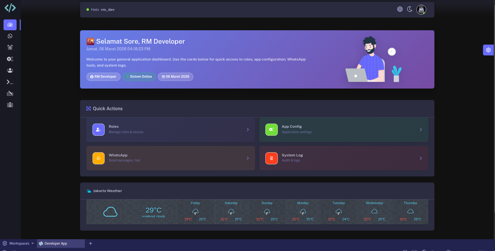
  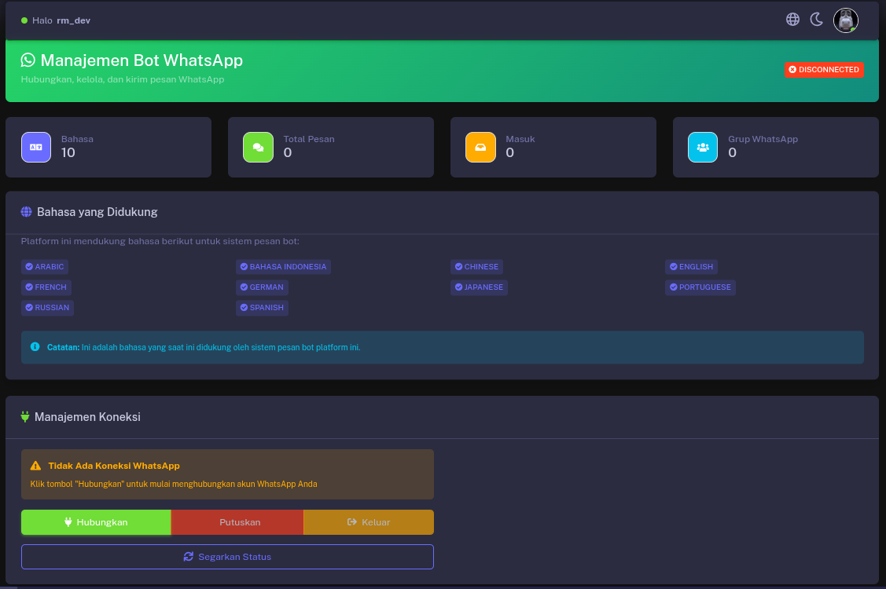
   
  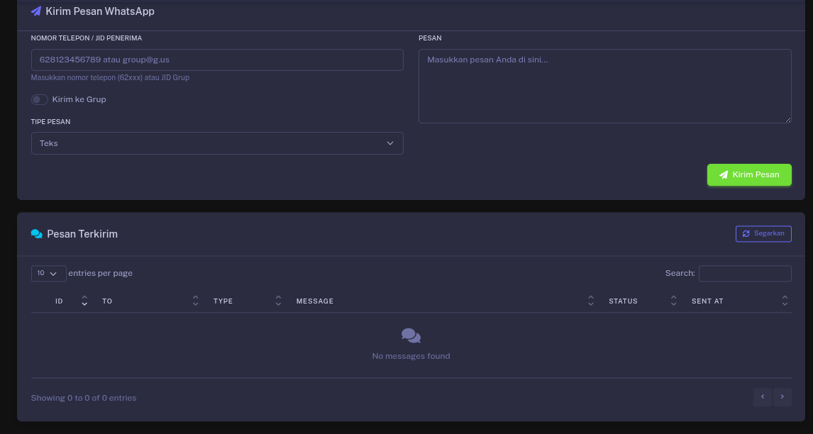
  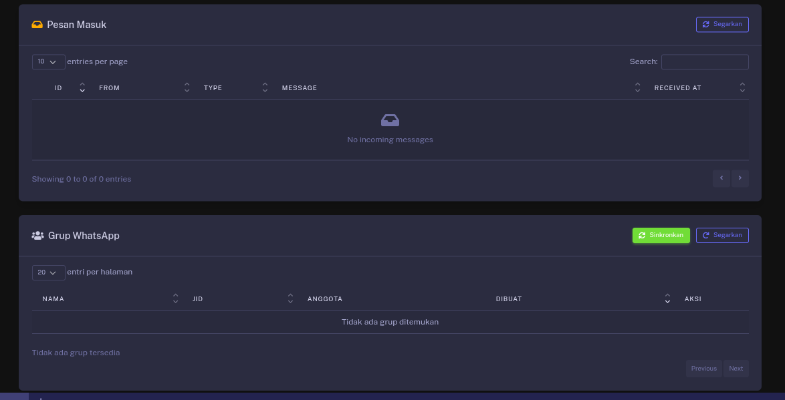
   
  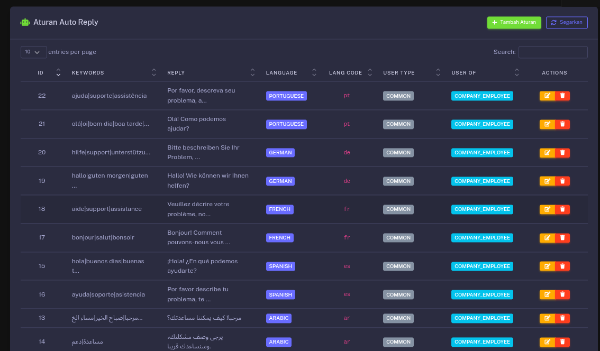
  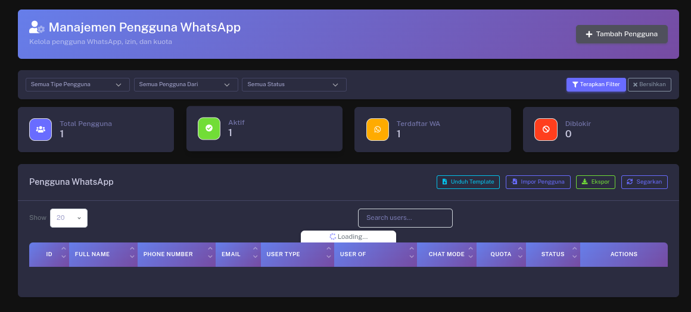

## 💻 CLI

  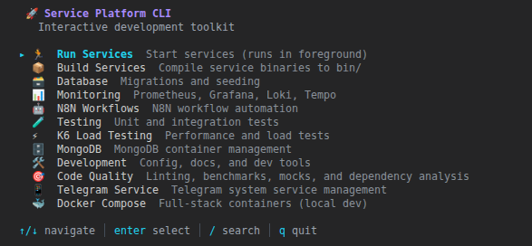

## 📊 Grafana Dashboards

  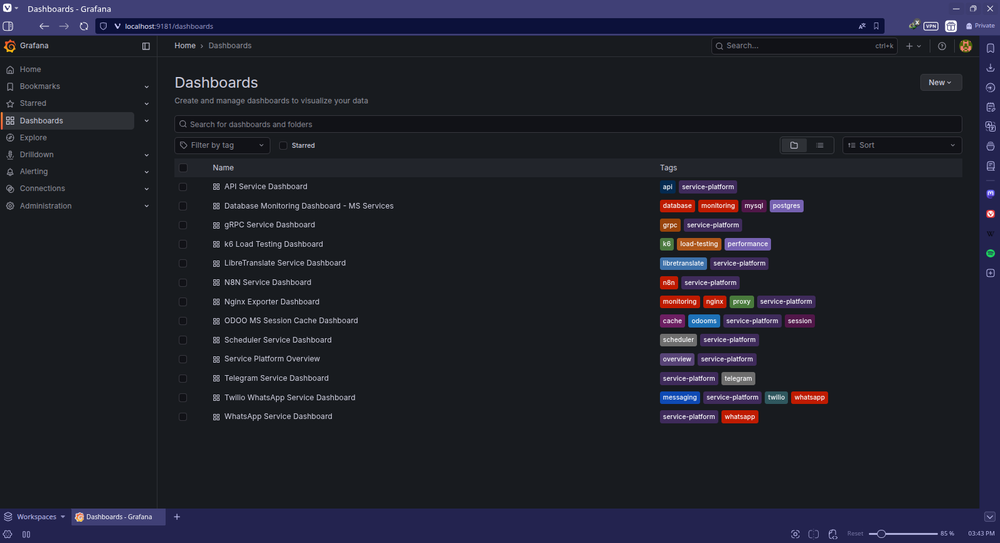
  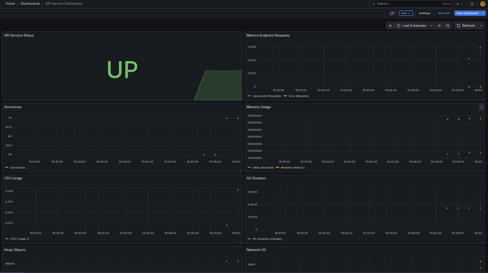
   
  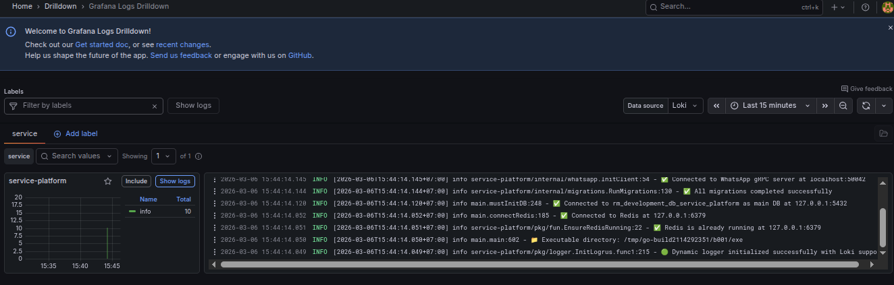
  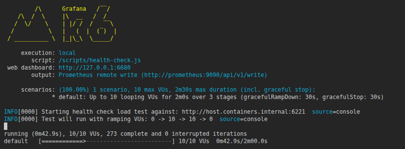
   
  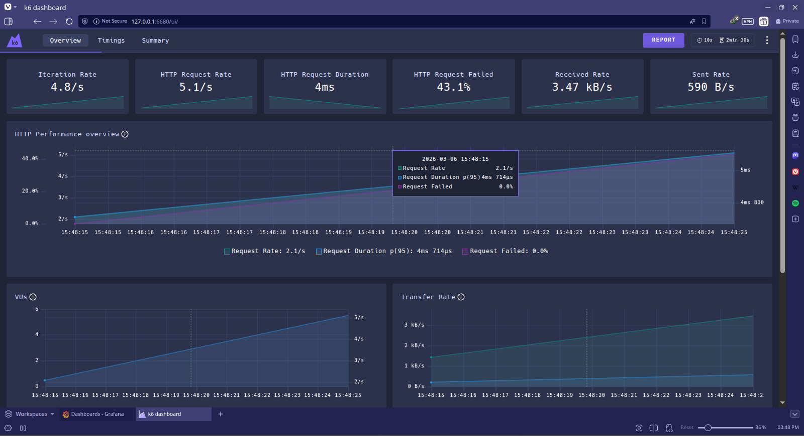
  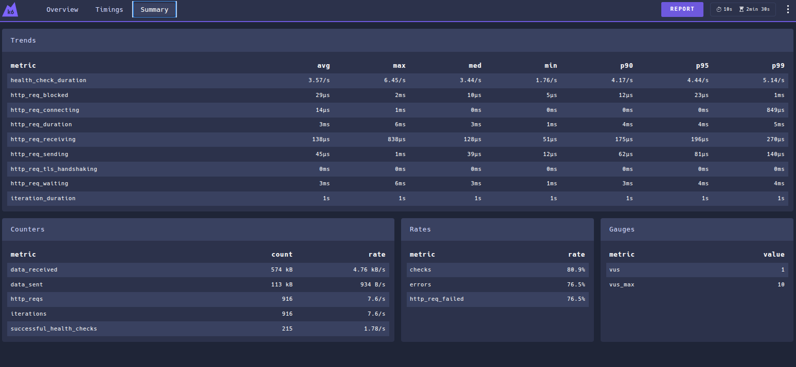

## 🍃 MongoDB

  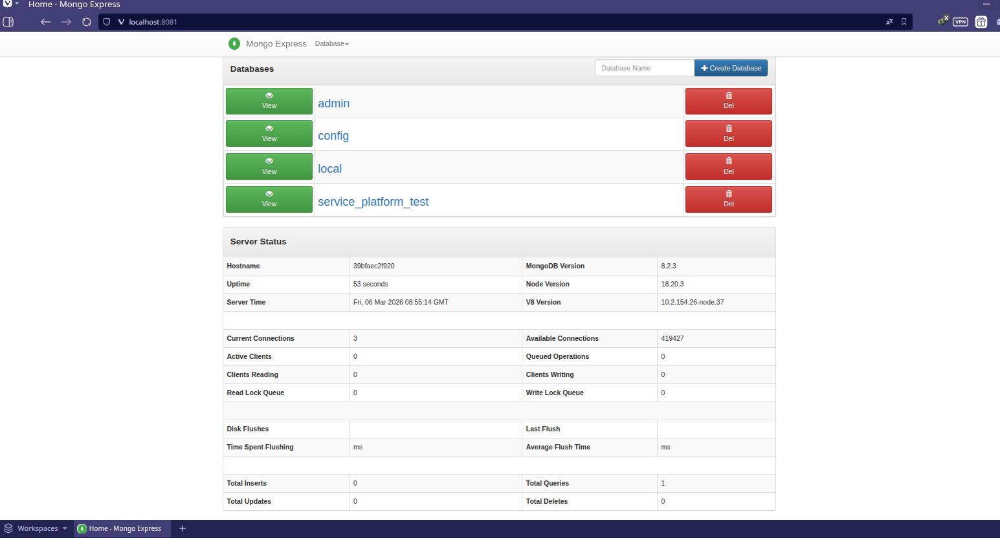
  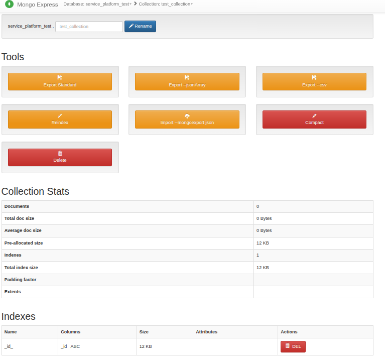

---

  <em>Service Platform</em>

